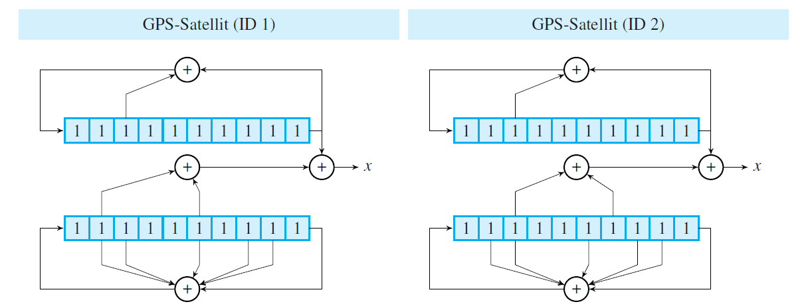

# Software-Decoder

## Überblick

Der Software-Decoder ist in der Lage, ein asynchrones CDMA-Signal aus einem sogenannten Summensignal zu decodieren. Hierbei handelt es sich um eine Übung an der Hochschule Karlsruhe für Technik und Wirtschaft. Das Signal soll dabei von Satelliten ausgestrahlt werden. Der implementierte Software-Decoder ist in der Lage, vierundzwanzig solcher Satelliten zu decodieren. Um die Signale unterscheiden zu können, hat jeder Satellit eine eigene Chipsequenz. Aus dem Summensignal lassen sich die gesendeten binären Bits extrahieren. Dabei handelt es sich um vier Bits unterschiedlicher Satelliten. Die Implementierung wird im nächsten Abschnitt erläutert.

## Implementierung 

Zuerst mussten die Chipsequenzen erzeugt werden. Hierbei handelt es sich um Pseudozufallsfolgen. Diese werden in der Praxis durch Hardwarekomponenten erzeugt. Dazu bieten sich sogenannte Schieberegister an. Zudem werden auch noch XOR-Gatter benötigt. Um nun eine Zufallsfolge zu generieren, werden die Bits in dem Register geshiftet. Das neue Bit das nach dem Shiften aufgefüllt wird, wird durch eine simple XOR-Verknüpfung ermittelt. Um nun die Chipsequenz zu erzeugen, müssen die Bits in den Registern 1023-mal gestiftet werden. Die Bits die beim Ausgang des Registers rauskommen entsprechen den Bits der Chipcodes. In der Folgenden Abbildung sieht man, wie der Hardware-Aufbau eines solchen Pseudozufallsgenerator aussieht. Von diesen gibt es in diesem Fall genau vierundzwanzig Stück.



### C++

Um die Pseudozufallszahlen nun genieren zu können, musste nun die oben dargestellten Hardware-Komponenten in C++ und C nach implementiert werden. Zuerst sollte die Implementierung in C++ stattfinden. Als Datenstruktur wurde der Vektor genutzt. Dieser wird in der Standardbibliothek mitgeliefert. Eine der Anforderungen der Aufgabe war es, ausschließlich Funktionen und Typen aus der Standardbibliothek zu nutzten. Alternativ durfte auch die Boost-Libary genutzt werden. Das schöne an Vektoren in C++ ist, dass diese wunderbar mit der Algorithmen Libary von C++ manipuliert wurden können. Anders als bei Arrays lassen sich hier in C++ Iteratoren nutzten. Dies erleichtert die Arbeit erheblich und es spart die eine oder andere Zeile Code. Beispielsweise kann man nun mit der Algorithmen Libary die Bits in dem Vektor rotieren oder shiften. Dazu stellt die Algorithmen Libary unter C++ für Vektoren passende Funktionen zur Verfügung. Diese haben beide die passenden Namen `rotate` und `shift_right` für einen sogenannten Rechts-Shift. Eine weitere Besonderheit im Gegensatz zu C ist, dass es das die sogenannte Typinferenz existiert. Mithilfe von `auto`  muss hier der Typ nicht mehr angeben werden. Ein netter Neben-Effekt ist der das lange Namespaces nur auf einer Seite geschrieben werden müssen. Um die Lesbarkeit zu erhöhen, wurde in jedem Fall daher das Schlüsselwort `auto` verwendet. Für das Obere und Untere Schieberegister mit seinen Chipsequenzen wurde jeweils eine eigene Methode geschrieben. Dabei handelt es sich um die Methoden `episodeOne()` und `episodeTwo(int a, int b)`. Der Parameter`a` und `b` entsprechen den zwei Bits die miteinander mit einer XOR Verknüpfung verknüpft werden müssen. Dabei handelt es sich um die zwei Bits die in das mittlere XOR_Gatter in der Oberen Grafik rein gehen. Die beiden Methoden geben jeweils einen Vektor zurück, welche im Anschluss mit der Methode`chipCodes()` durch eine weiter XOR-Verknüpfung verknüpft werden. Diese Aufteilung sollte die Lesbarkeit des Codes erhöhen und auch das Debuggen bei Fehlern erleichtern. Wie die Bits beim unteren Schieberegister verknüpft werden müssen, kann man der unteren Tabelle entnehmen. Nun fehlen nur noch die Daten des Summensignal aus der Textdatei. Diese Daten werden ebenfalls mit C++ ausgelesen. Dazu bietet sich die `Input File Stream Klasse` unter C++ an. Mithilfe dieser Klasse lassen sich einfach einzelne Wörter über den Stream Operator `>>` auslesen. Zudem prüft der Operator gleichzeitig ob noch Wörter vorhanden sind. Dazu bietet sich eine `while` Schleife bestens an. Die Daten werden beim Auslesen dann wieder direkt in einen Vektor gepackt, um diese Daten mit den Chipsequenz-Daten zu verarbeiten.
        


Nun gilt es mithilfe der Chipsequenzen die Daten aus dem Summensignal auszulesen. Dazu müssen alle Chipsequenzen mit dem Summensignal abgeglichen werden. Da es sich hier jedoch um ein asynchrones Signal handelt, muss man die Chipsequenz in jeder rotierten Variante mit dem Summensignal Abgleich. Die Chipsequenz muss also 1023 mal rotiert werden und bei jeder Rotation mit dem Summensignal abgeglichen werden. Falls unter der Chipsequenz ein Bit gesendet wurde, gibt es einen sogenannten Peak. Dabei kommt ein hoher Zahlen Wert heraus, welcher um die 800 oder -800 liegt. Es reicht jedoch ein Abgleich, ob der Zahlenwert höher als 256 ist. Dies lässt sich mit etwas rum probieren herausfinden. Wenn der Wert in dem Bereich liegt erfolgt eine entsprechende Ausgabe. Das Konstrukt entspricht also drei ineinander verschachtelten `for` Schleifen. Dies würde heißen, dass die Laufzeit bei O(n³) liegen würde. Die äußerste Schleife rotiert über die vierundzwanzig Chipsequenzen. Die mittlere sorgt für die Rotation und die letzte Berechnet das Kreuzprodukt, wodurch sich der Peak ermitteln lässt. Im Anschluss soll hier noch eben auf die Implementierung in C eingegangen werden. An dem Grundsätzlichen Aufbau ändert sich jedoch nichts mehr.

### C

Der C++ Code wurde so gesehen direkt in C umgewandelt. Es mussten jedoch einige Anpassungen vorgenommen werden. Beispielsweise konnte jetzt nicht mehr die Datenstruktur eines Vektors unter C genutzt werden, da es diesen unter C nicht gibt. Stattdessen wurde als Datenstruktur nun ein Array genutzt.  Jedoch wurde das Programm wieder in dieselben Methoden zerlegt wie beim C++ Programm. Es existieren also wieder die Methoden `episodeOne(int *episode)` , `episodeTwo(int *episode, int a, int b)` und  `chipCodes(int chipSequences[][messageLength])`. Hier sieht man jedoch nun einen entscheiden Unterschied. Anders als bei C++ wurde sich hier nun dafür entschieden die Datenstrukturen über den Parameter reinzureichen und dann in der Methode aufzufüllen. Dies ist eine Gängige Methode unter C. Auch hier existiert eine `readFile(const char *fileName, int *data)` Funktion, welche die Datei ausließt. Hier werden zwar auch wieder andere Methoden verwendet, jedoch ist das Prinzip das gleiche wie bei C++. Da es unter C keine mitgelieferte Shift Methode gibt, muss diese selbst implementiert werden. Glücklicherweise gibt es hierbei einen Trick,um daraus lediglich einen Drei-Zeiler zu machen. 

````c
for (int j = bitfieldLength - 1; j > 0; j--) {
	 bitfield[j] = bitfield[j - 1];
}
````

Die Bitrotierung habe ich in der nicht optimierten Variante ähnlich durchgeführt. Es kamen lediglich zwei Zeilen Code hinzu. Das letzte Bit wird zwischengespeichert und anschließend vorne wieder dran gehängt, dazwischen wird wieder geshiftet. Wie sich später rausstellt, lässt sich diese Variante jedoch noch optimieren.


````c
int rotateBit = chipSequences[id][messageLength - 1];
for (int j = messageLength - 1; j > 0; j--) {
     chipSequences[id][j] = chipSequences[id][j - 1];
}
chipSequences[id][0] = rotateBit;
````

Der Rest bleibt wie gehabt und es gibt keine Änderungen in Vergleich zu C++. Im nächsten Abschnitt wird noch eben auf das Buildsystem `make` eingegangen. 


### Buildsystem make

Um sowohl C++ als auch C zu bauen, verwenden wir das Build-Tool `make`  . Dieses führt in unserem Fall den `clang` Befehl aus, der unser Programm Kompiliert. Zudem lässt sich das Verzeichnis hiermit wieder aufräumen.  Dem Clang Befehl müssen einige Flags mitgegeben werden. Das erste Flag heißt `-std` . Hierrüber lässt sich die Programm Version mitgeben. Bei C++ ist es in diesem Fall `C++20` und bei C ist es `C11` . Zu diesem Zeitpunkt sind das bei beiden Sprachen die aktuellsten Versionen. Außerdem muss das `-Wall` Flag gesetzt werden. Dieses sorgt dafür, dass einige Warnungstypen mehr in der Konsole ausgeben werden. Zudem wird nachher in der optimierte Variante noch das `-O3` Flag mitgeben, welches Optimierung durch den Compiler zulässt. Die Programmlaufzeiten können hierdurch erheblich verbessert werden. Beispielsweise wurde somit die Programmlaufzeit des C++ Programms um etwa 6 Sekunden verbessert. Im Folgenden sieht man, wie der `Makefile` aussieht. Mit dem Befehl `make` lässt sich das Programm im jeweiligen Verzeichnis bauen und mit `make clean` lässt sich das Verzeichnis wieder aufräumen und das Binary wird gelöscht.   

````makefile
prog:
	clang main.c -std=c11 -Wall
clean:
	rm a.*
````


# Optimierungen

Die erste Optimierung die in dem Programm vorgenommen wurde, ist Logischer Natur. Durch einen kleinen Trick lassen sich nämlich einige Schleifendurchläufe vermeiden. Sobald bei einem Schleifendurchlauf ein Peak gefunden wurde, kann der Vorgang abgebrochen werden. Da wir hier `O(n³)` haben kann dies einiges an Zeit aus machen. Diese Optimierung hat mir eine Zeitersparnis von etwa 12 Millisekunden eingebracht.

````c
if (256 < crossProduct) {
	printf("Satellite %2d has sent bit 1 (delta = %3d)\n", id + 1, delta + 1);
    break;
} else if (-256 > crossProduct) {
	printf("Satellite %2d has sent bit 0 (delta = %3d)\n", id + 1, delta + 1);
    break;
}
````


Die nächste Optimierung ist etwas kniffliger. Was bis jetzt nicht erwähnt wurde ist, dass bis jetzt eigentlich vier `for` Schleifen verwendet wurden. Das heißt, dass wir eigentlich eine Laufzeit von `O(n⁴)` hatten. Die Rotation wurde ebenfalls noch in einer Schleife gelöst. Doch durch einen Trick lässt sich diese wegoptimieren. Dazu muss man die Chipsequenz anfangs zwei mal hintereinander schreiben. Nun durchläuft man bei jedem Schleifen Durchlauf die Chipsequenz um einen nach rechts versetzt bis 1023. Dies macht man wiederum 1023 mal. Dieses Verhalten entspricht der einer links Rotation. Dies spart einiges an Zeit. Insgesamt lag auf der getesteten Maschine eine Zeitersparnis von 54 Millisekunden vor.  Hier sieht man, wie der Schleifendurchlauf nun aussieht. Was hier nicht zu sehen ist, wie die Befüllung der Datenstruktur von `chipSequences` aussieht.


`````c
for (int16_t number = 0; number < messageLength; number++) {
     crossProduct += chipSequences[id][number+delta] * data[number];
}
`````

Die nächste Optimierung war eine Schleifen Optimierung. Es ließ sich ein Schleifendurchlauf zusammenfassen. Dies brachte eine Zeitersparnis von 2ms. Der Fall nachher ist identisch zu dem von vorher. Bis auf den letzten Befehlsausdruck. Dieser ist noch für die zweite Optimierung, welche die zweite Hälfte auffüllt.


Vorher:

`````c
for (int j = 0; j < messageLength; j++) {
     secondEpisode[j] = secondEpisode[j] ^ firstEpisode[j];
}
for (int k = 0; k < messageLength; k++) {
     chipSequences[i][k] = secondEpisode[k];
}
`````

Nachher:

````c
for (int16_t k = 0; k < messageLength; k++) {
     secondEpisode[k] = secondEpisode[k] ^ firstEpisode[k];
     chipSequences[i][k] = secondEpisode[k];
     chipSequences[i][k+messageLength] = secondEpisode[k];
}
````


Bei der vorletzten Optimierung handelt es sich um eine Compiler Optimierung. Dazu muss man wie bereits erwähnt das `-O3` Flag bei `clang` setzten. Dadurch kann der Compiler endlich Optimierungen vornehmen. Die Zeitersparnis betrug hier 44 Millisekunden. Die letzte Optimierung wurde dann durch kleiner Datentypen erzielt. Dazu wurden die `int` durch `int8_t` und `int16_t` ersetzt. Dies verkürzt die Zugriffszeiten. Die Zeitersparnis betrug hier 5ms. 

Die Zeit wurde bei allen Programmen mit der `time.h` Libary gemessen. Der folgende Code Abschnitt zeigt dabei das vorgehen. Es wird anfangs die Startzeit gemessen und nach dem Programmlauf wird ebenfalls noch einmal die Zeit gemessen. Diese Zeiten müssen nur noch voneinander Subtrahiert werden.  

````c
clock_t start, stop;
start = clock();
// Hier zwischen befindet sich das eigentliche Programm
stop = clock();
printf("\n%.0f Milliseconds\n", ((double)(stop - start) / CLOCKS_PER_SEC) * 1000);
````

# Projekt starten

Unter Windows muss man zuerst `make` eingeben und dann `a.exe ...\txt `. Der zweite Parameter ist der Dateiname der mit angeben werden muss. Dieser muss sich in dem Fall ein Verzeichnis unter dem der Anwendung befinden. Unter anderen Betriebssystemen ist die Datei Endung des Programmes anders. 


# Quellen 

Die beiden Bilder stammen aus dem Buch "Einführung in die Informations- und Codierungstheorie" von Dirk W. Hoffmann.

